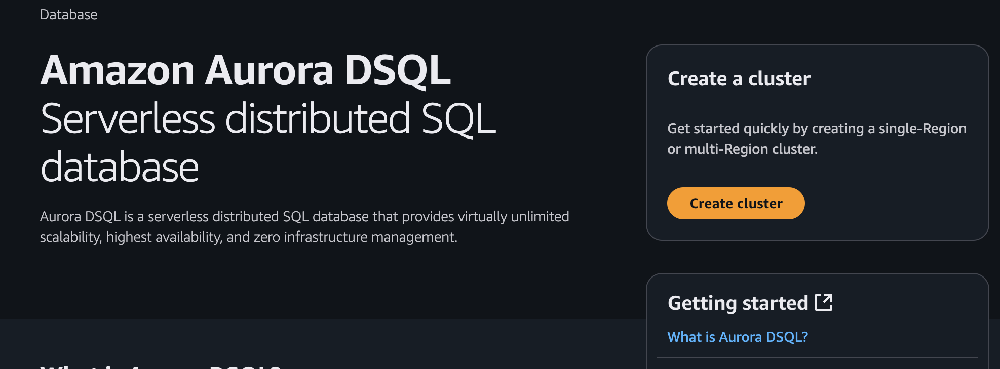
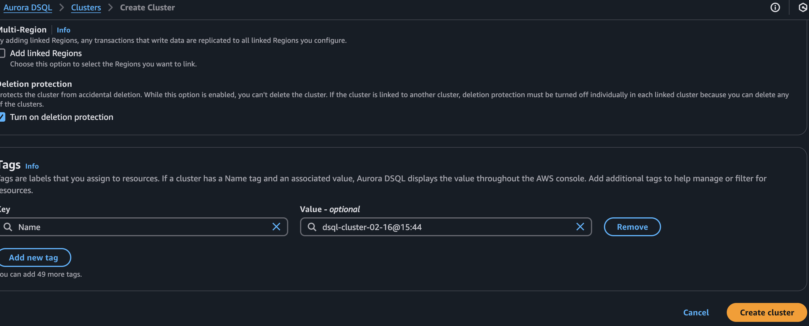
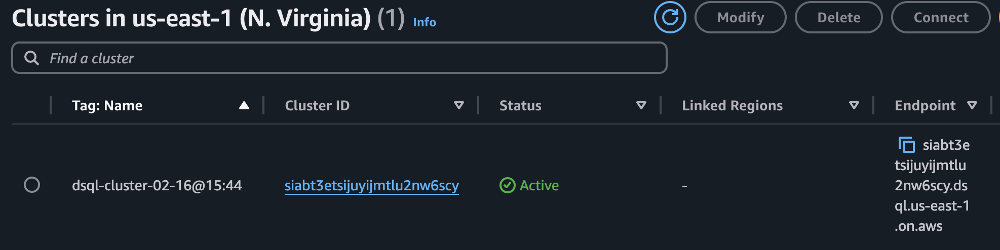
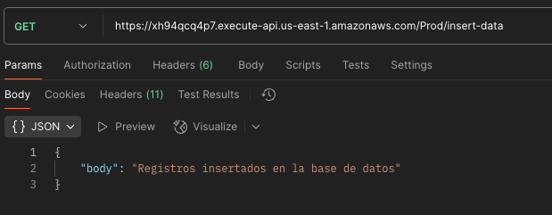
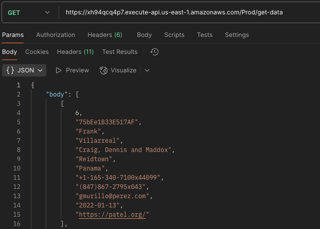

# Proyecto Demo DSQL

Este proyecto es una demostración práctica con AWS SAM (Serverless Application Model) del nuevo servicio Amazon Aurora DSQL.

## Requisitos Previos

- Creación manual del cluster de Aurora DSQL
- Cuenta de AWS activa
- AWS CLI instalado y configurado
- Docker (opcional, para construcción con contenedores)
- Python (opcional)

## Creación de cluster de Aurora DSQL

Durante el Preview, Aurora DSQL no se encuentra disponible para ser desplegado a partir de Cloudformation, por esto es necesaria su creación desde la consola de AWS.

### 1. Creación de cluster







> **Importante**: Toma nota del cluster id y endpoint, ya que será necesario más tarde.

## Pasos de Instalación

### 1. Clonar el repositorio

```shell
git clone https://github.com/londoso/demo-dsql.git
```

### 2. Instalación de AWS SAM CLI

Para instalar AWS SAM CLI, sigue los pasos en la [guía oficial de instalación](https://docs.aws.amazon.com/serverless-application-model/latest/developerguide/install-sam-cli.html).

Para verificar la instalación:
```shell
sam --version
```

## Construcción y Despliegue

### 1. Construcción del Proyecto

**Opción A**: Con Python instalado localmente
```shell
sam build
```

**Opción B**: Usando contenedores Docker (sin Python)
```shell
sam build --use-container
```

### 2. Despliegue en AWS

```shell
sam deploy --guided
```

```toml
Stack Name [demo-dqsl]: 
AWS Region [us-east-1]: 
Parameter ClusterId [siabt3etsijuyijmtlu2nw6scy]: 
Parameter DataBucket [dqsl-demo-data-londoso]: 
#Shows you resources changes to be deployed and require a 'Y' to initiate deploy
Confirm changes before deploy [Y/n]: 
#SAM needs permission to be able to create roles to connect to the resources in your template
Allow SAM CLI IAM role creation [Y/n]: 
#Preserves the state of previously provisioned resources when an operation fails
Disable rollback [y/N]: 
InsertDataFunction has no authentication. Is this okay? [y/N]: Y
GetDataFunction has no authentication. Is this okay? [y/N]: Y
Save arguments to configuration file [Y/n]: 
SAM configuration file [samconfig.toml]: 
SAM configuration environment [default]: 
```

### 3. Prueba de los endpoints





### 4. Limpieza de Recursos

Para evitar cargos innecesarios, elimina los recursos cuando ya no los necesites:

```shell
sam delete
```

## Enlaces de Referencia

- [Documentación AWS SAM](https://docs.aws.amazon.com/serverless-application-model/latest/developerguide/what-is-sam.html)
- [Amazon Aurora DSQL](https://docs.aws.amazon.com/aurora-dsql/)